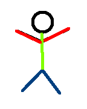

## Escuela Colombiana de Ingeniería

### Procesos de Desarrollo de Software 

## Laboratorio - Patrones Creacionales, Principios SOLID

__Trabajo individual o en parejas__

## Entregables:

**Jueves en clase**: Diseño de la nueva aplicación (diagrama de clases + diagrama de paquetes).

**Martes en clase**: Avance + dudas.

**Jueves a las 10:00am**: Ejercicio terminado.

***Instrucciones para Maven y GIT:*** Se requiere Linux.
* Para descargar la aplicación, desde una terminal, clone el repositorio, y luego abralo con NetBeans:

	```bash
	git clone git@github.com:PDSW-ECI/GoF-CreationalPatterns-FactoryMethod-Hangman.git
	```
* Para compilar, desde el directorio creado con el paso anterior:
	```bash
	mvn compile
	```
* Para ejecutar:
	```bash
	mvn exec:java  -Dexec.mainClass=hangman.SwingProject
	```

En este repositorio se encuentra una versión de escritorio del popular juego 'ahorcado' (la cual es una versión ligeramente modificada del proyecto desarrollado por Omar Rodriguez y Nahid Enayatzadeh).


Como se observa en la imagen anterior, el juego está orientado al público de habla inglesa (el juego de caracteres y el juego de palabras que se presentan al azar corresponden al inglés), y como representación gráfica se hace uso del popular 'stickman'

__Ejercicio.__

Se le ha pedido que revise la aplicación y haga con la misma un ejericicio de ‘refactoring’, de manera que para la misma se logre cumplir con el principio abierto/cerrado en los siguientes aspectos:

- El juego debe poderse internacionalizar fácilmente. Es decir, la aplicación se debe poder adaptar a nuevos idiomas sin necesidad de el _CORE_ de la misma, teniendo en cuenta que un nuevo idioma implica:
	* Un conjunto de posibles palabras a adivinar diferente.
	* Un conjunto de caracteres diferente (por ejemplo, en español y portugués se tendrán caracteres especiales).
	* Textos diferentes en las etiquetas y botones de la interfaz de usuario.

- El juego debe poderse adaptar a nuevos estilos visuales del 'ahorcado', nuevamente sin tener que modificar el _CORE_.

Como prueba de concepto, se espera que la aplicación inicialmente soporte tres idiomas:


- Inglés (el usuado actualmente).
- Español:
	* El mismo juego de caracteres del inglés, pero incluyendo la Ñ.
	* Como conjunto de palabras, al menos cinco tomadas de [este enlace.](http://www.clarin.com/sociedad/palabras-mas-usadas-espanol-comunes-frecuentes-diccionario-real_academia_espanola_0_ByLqjSFvmg.html)

- Francés:
	* El mismo juego de caracteres del inglés, pero incluyendo: à, è, ì, ò, ù .
	* Como conjunto de palabras, al menos cinco tomadas de [este enlace.](http://www.lexisrex.com/Palabras-Frecuentes-Franc%C3%A9s/page=3).


Por otro lado, se quiere manejar tres estilos visuales para el ahorcado:

- El 'stickman' tradicional, usado actualmente.
- Ahorcado no violento:	No muestra una horca, sino signos de admiración al personaje tras cada error:

	

- Ahorcado colorido: un 'stickman' tradicional pero con color.

	


### Proceso sugerido:

1. Proponga un nuevo diseño para la aplicación, donde se tengan clases que encapsulen las operaciones de la aplicación sujetas a eventuales cambios.
2. Aplique el principio de [Inversión de dependencias](https://dzone.com/articles/the-dependency-inversion-principle-dip-or-d-in-soi) en la manera de relacionar las clases identificadas anteriormente con el _CORE_ de la aplicación.
2. Con lo anterior, haga un diseño que adicionalmente considere el patrón [Método Fábrica](https://dzone.com/articles/design-patterns-factory) para el problema de la creación de las clases concretas. Tip: los productos concretos serán las clases identificadas en el paso 1.

3. Use como referencia [uno de los ejemplos de implementación disponibles](https://github.com/PDSW-ECI/GoF-FactoryMethod-ReferenceExample), en donde se plantea también el uso del patrón Singleton (para la creación de la fábrica concreta).


## Criterios de evaluación

<!--1. Funcionalidad. La aplicación debe poderse configurar, sin tener que tocar el _CORE_ de la misma, para
	* Usar un formato de documento basado en objetos String serializadas, o uno basado en texto plano.

2. La solución debe quedar abierta para extensión y cerrada para modificación. Es decir, debe permitir (sólo configurando el esquema de fábricas):
	* Agregar nuevos esquemas de persistencia.
	* Agregar nuevas estrategias de corrección automática.
-->


<a rel="license" href="http://creativecommons.org/licenses/by-nc/4.0/"></a><br />Este contenido hace parte del curso Procesos de Desarrollo de Software del programa de Ingeniería de Sistemas de la Escuela Colombiana de Ingeniería, y está licenciado como <a rel="license" href="http://creativecommons.org/licenses/by-nc/4.0/">Creative Commons Attribution-NonCommercial 4.0 International License</a>.